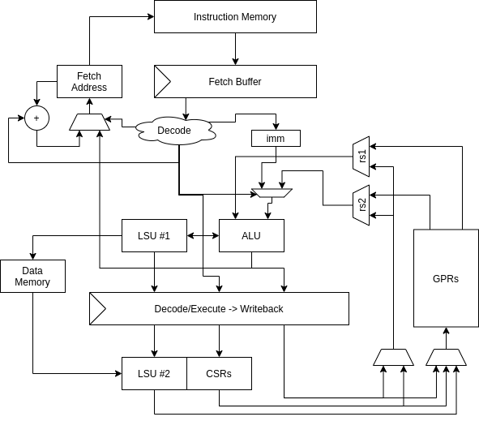

# Croyde RISC-V

*A 3-stage, 64-bit RISC-V rv64imck micro-controller.*
[](https://www.travis-ci.com/ben-marshall/croyde-riscv)
[](https://croyde-riscv.readthedocs.io/en/latest/?badge=latest)

---

- [Getting Started](#Getting-Started)
- [Block Diagram](#Block-Diagram)
- [Documentaton](docs/)
- [FAQ](#FAQ)

## Features & Block Diagram

This is a very simple 3-stage 64-bit micro-controller, implementing the
`rv64imck` instruction set.
It comes as a *core* module, and a *core complex* (CCX), which wraps the
core with timers, boot ROM, some RAM and other small peripherals, with
a memory port to the outside world.



Note that the [`K` extension](https://github.com/riscv/riscv-crypto)
is for cryptography, and is still under development.

## Getting Started

- Required Dependencies:
  [Yosys](http://www.clifford.at/yosys/documentation.html),
  [Verilator](https://www.veripool.org/projects/verilator/wiki/Intro),
  [Boolector](https://boolector.github.io/),
  [Symbiyosys](https://symbiyosys.readthedocs.io/en/latest/)
  and a
  [RISC-V Toolchain](https://github.com/riscv/riscv-gnu-toolchain).

- Checkout the repository:
  ```sh
   git checkout https://github.com/ben-marshall/croyde-riscv.git
   cd croyde-riscv/
   git submodule update --init --recursive
  ```

- Setup the project workspace:
  ```sh
  source bin/conf.sh
  ```

- [Synthesise the core](docs/flows-synthesis.md) using Yosys
  [Yosys](http://www.clifford.at/yosys/documentation.html).

- Verify the core using the 
  [riscv-formal](docs/flows-riscv-formal.md)
  framework.

- Run the RISC-V
  [architectural compliance tests](docs/flows-arch-tests.md).

- Run the [confidence tests](docs/flows-unit-tests.md) set.


## FAQ

- Can I use this for X? - Yes you can. It's all MIT licensed.

- Should I use this for X? - Maybe. If you want a little RV64 core
  for your project, that is free, go for it. However, see the next bullet
  point.

- Has this been verified? - I have high confidence the user level
  ISA and instructions is correct though the riscv-formal framework.
  Plus the basic RISC-V architectural tests all pass, which is a basic
  tyre kick. I have less confidence in the priviliged architecture
  and interrupts implementation, or the core complex. It works for me,
  and my needs, but I've not done any exhaustive verification on it.

- What's the point of a 64-bit *micro-controller*? - If it's good enough
  for [SiFive](https://www.sifive.com/cores/s21) 
  it's good enough for me. I wanted to implement RV64 in the
  simplest way possible to play around with on an cheap FPGA, which meant it
  had to be small to fit! More seriously, if your key workloads involve
  working on large variables, you might find a 64-bit core makes a lot
  of sense.

- What's in the name? - Nothing really. *Croyde* is a fantastic beach for
  surfing near where I grew up and there wasn't much chance of someone
  else picking the same name.

